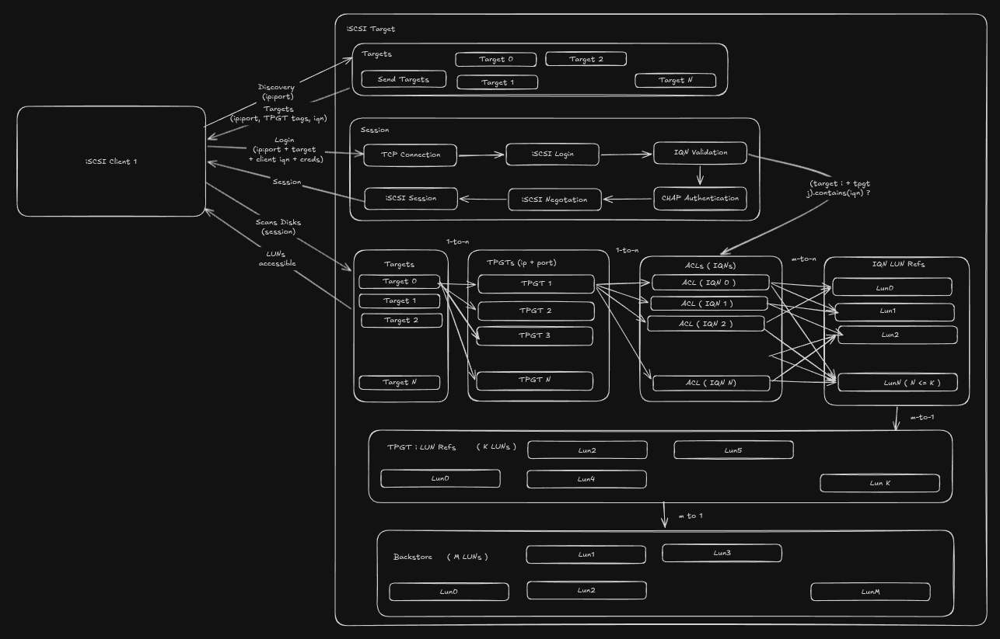

### iSCSI Metrics

## iSCSI Archtecture



## All Metrics and Configurations

```
iscsi@iscs-target:~$ tree /sys/kernel/config/target
/sys/kernel/config/target
├── core
│   ├── alua
│   │   └── lu_gps
│   │       └── default_lu_gp
│   │           ├── lu_gp_id
│   │           └── members
│   └── fileio_0
│       ├── disk01
│       │   ├── action
│       │   ├── alias
│       │   ├── alua
│       │   │   └── default_tg_pt_gp
│       │   │       ├── alua_access_state
│       │   │       ├── alua_access_status
│       │   │       ├── alua_access_type
│       │   │       ├── alua_support_active_nonoptimized
│       │   │       ├── alua_support_active_optimized
│       │   │       ├── alua_support_lba_dependent
│       │   │       ├── alua_support_offline
│       │   │       ├── alua_support_standby
│       │   │       ├── alua_support_transitioning
│       │   │       ├── alua_support_unavailable
│       │   │       ├── alua_write_metadata
│       │   │       ├── implicit_trans_secs
│       │   │       ├── members
│       │   │       ├── nonop_delay_msecs
│       │   │       ├── preferred
│       │   │       ├── tg_pt_gp_id
│       │   │       └── trans_delay_msecs
│       │   ├── alua_lu_gp
│       │   ├── attrib
│       │   │   ├── alua_support
│       │   │   ├── block_size
│       │   │   ├── emulate_3pc
│       │   │   ├── emulate_caw
│       │   │   ├── emulate_dpo
│       │   │   ├── emulate_fua_read
│       │   │   ├── emulate_fua_write
│       │   │   ├── emulate_model_alias
│       │   │   ├── emulate_pr
│       │   │   ├── emulate_rest_reord
│       │   │   ├── emulate_rsoc
│       │   │   ├── emulate_tas
│       │   │   ├── emulate_tpu
│       │   │   ├── emulate_tpws
│       │   │   ├── emulate_ua_intlck_ctrl
│       │   │   ├── emulate_write_cache
│       │   │   ├── enforce_pr_isids
│       │   │   ├── force_pr_aptpl
│       │   │   ├── hw_block_size
│       │   │   ├── hw_max_sectors
│       │   │   ├── hw_pi_prot_type
│       │   │   ├── hw_queue_depth
│       │   │   ├── is_nonrot
│       │   │   ├── max_unmap_block_desc_count
│       │   │   ├── max_unmap_lba_count
│       │   │   ├── max_write_same_len
│       │   │   ├── optimal_sectors
│       │   │   ├── pgr_support
│       │   │   ├── pi_prot_format
│       │   │   ├── pi_prot_type
│       │   │   ├── pi_prot_verify
│       │   │   ├── queue_depth
│       │   │   ├── submit_type
│       │   │   ├── unmap_granularity
│       │   │   ├── unmap_granularity_alignment
│       │   │   └── unmap_zeroes_data
│       │   ├── control
│       │   ├── enable
│       │   ├── info
│       │   ├── lba_map
│       │   ├── pr
│       │   │   ├── res_aptpl_active
│       │   │   ├── res_aptpl_metadata
│       │   │   ├── res_holder
│       │   │   ├── res_pr_all_tgt_pts
│       │   │   ├── res_pr_generation
│       │   │   ├── res_pr_holder_tg_port
│       │   │   ├── res_pr_registered_i_pts
│       │   │   ├── res_pr_type
│       │   │   └── res_type
│       │   ├── statistics
│       │   │   ├── scsi_dev
│       │   │   │   ├── indx
│       │   │   │   ├── inst
│       │   │   │   ├── ports
│       │   │   │   └── role
│       │   │   ├── scsi_lu
│       │   │   │   ├── creation_time
│       │   │   │   ├── dev
│       │   │   │   ├── dev_type
│       │   │   │   ├── full_stat
│       │   │   │   ├── hs_num_cmds
│       │   │   │   ├── indx
│       │   │   │   ├── inst
│       │   │   │   ├── lun
│       │   │   │   ├── lu_name
│       │   │   │   ├── num_cmds
│       │   │   │   ├── prod
│       │   │   │   ├── read_mbytes
│       │   │   │   ├── resets
│       │   │   │   ├── rev
│       │   │   │   ├── state_bit
│       │   │   │   ├── status
│       │   │   │   ├── vend
│       │   │   │   └── write_mbytes
│       │   │   └── scsi_tgt_dev
│       │   │       ├── aborts_complete
│       │   │       ├── aborts_no_task
│       │   │       ├── indx
│       │   │       ├── inst
│       │   │       ├── non_access_lus
│       │   │       ├── num_lus
│       │   │       ├── resets
│       │   │       └── status
│       │   ├── udev_path
│       │   └── wwn
│       │       ├── company_id
│       │       ├── product_id
│       │       ├── revision
│       │       ├── vendor_id
│       │       ├── vpd_assoc_logical_unit
│       │       ├── vpd_assoc_scsi_target_device
│       │       ├── vpd_assoc_target_port
│       │       ├── vpd_protocol_identifier
│       │       └── vpd_unit_serial
│       ├── hba_info
│       └── hba_mode
├── dbroot
├── iscsi
│   ├── cpus_allowed_list
│   ├── discovery_auth
│   │   ├── authenticate_target
│   │   ├── enforce_discovery_auth
│   │   ├── password
│   │   ├── password_mutual
│   │   ├── userid
│   │   └── userid_mutual
│   ├── iqn.2026-03.lab.local:lab.target01
│   │   ├── fabric_statistics
│   │   │   ├── iscsi_instance
│   │   │   │   ├── description
│   │   │   │   ├── disc_time
│   │   │   │   ├── fail_rem_name
│   │   │   │   ├── fail_sess
│   │   │   │   ├── fail_type
│   │   │   │   ├── inst
│   │   │   │   ├── max_ver
│   │   │   │   ├── min_ver
│   │   │   │   ├── nodes
│   │   │   │   ├── portals
│   │   │   │   ├── sessions
│   │   │   │   ├── vendor
│   │   │   │   └── version
│   │   │   ├── iscsi_login_stats
│   │   │   │   ├── accepts
│   │   │   │   ├── authenticate_fails
│   │   │   │   ├── authorize_fails
│   │   │   │   ├── indx
│   │   │   │   ├── inst
│   │   │   │   ├── negotiate_fails
│   │   │   │   ├── other_fails
│   │   │   │   └── redirects
│   │   │   ├── iscsi_logout_stats
│   │   │   │   ├── abnormal_logouts
│   │   │   │   ├── indx
│   │   │   │   ├── inst
│   │   │   │   └── normal_logouts
│   │   │   ├── iscsi_sess_err
│   │   │   │   ├── cxn_errors
│   │   │   │   ├── digest_errors
│   │   │   │   ├── format_errors
│   │   │   │   └── inst
│   │   │   └── iscsi_tgt_attr
│   │   │       ├── fail_intr_addr
│   │   │       ├── fail_intr_addr_type
│   │   │       ├── fail_intr_name
│   │   │       ├── indx
│   │   │       ├── inst
│   │   │       ├── last_fail_time
│   │   │       ├── last_fail_type
│   │   │       └── login_fails
│   │   ├── param
│   │   │   ├── cmd_completion_affinity
│   │   │   ├── default_submit_type
│   │   │   └── direct_submit_supported
│   │   └── tpgt_1
│   │       ├── acls
│   │       │   └── iqn.2026-03.lab.local:node01.initiator01
│   │       │       ├── attrib
│   │       │       │   ├── authentication
│   │       │       │   ├── dataout_timeout
│   │       │       │   ├── dataout_timeout_retries
│   │       │       │   ├── default_erl
│   │       │       │   ├── nopin_response_timeout
│   │       │       │   ├── nopin_timeout
│   │       │       │   ├── random_datain_pdu_offsets
│   │       │       │   ├── random_datain_seq_offsets
│   │       │       │   └── random_r2t_offsets
│   │       │       ├── auth
│   │       │       │   ├── authenticate_target
│   │       │       │   ├── password
│   │       │       │   ├── password_mutual
│   │       │       │   ├── userid
│   │       │       │   └── userid_mutual
│   │       │       ├── cmdsn_depth
│   │       │       ├── fabric_statistics
│   │       │       │   └── iscsi_sess_stats
│   │       │       │       ├── cmd_pdus
│   │       │       │       ├── conn_digest_errors
│   │       │       │       ├── conn_timeout_errors
│   │       │       │       ├── indx
│   │       │       │       ├── inst
│   │       │       │       ├── node
│   │       │       │       ├── rsp_pdus
│   │       │       │       ├── rxdata_octs
│   │       │       │       └── txdata_octs
│   │       │       ├── info
│   │       │       ├── lun_0
│   │       │       │   ├── 95541fccc6 -> ../../../../../../../target/iscsi/iqn.2026-03.lab.local:lab.target01/tpgt_1/lun/lun_0
│   │       │       │   ├── statistics
│   │       │       │   │   ├── scsi_att_intr_port
│   │       │       │   │   │   ├── dev
│   │       │       │   │   │   ├── indx
│   │       │       │   │   │   ├── inst
│   │       │       │   │   │   ├── port
│   │       │       │   │   │   ├── port_auth_indx
│   │       │       │   │   │   └── port_ident
│   │       │       │   │   └── scsi_auth_intr
│   │       │       │   │       ├── att_count
│   │       │       │   │       ├── creation_time
│   │       │       │   │       ├── dev
│   │       │       │   │       ├── dev_or_port
│   │       │       │   │       ├── hs_num_cmds
│   │       │       │   │       ├── indx
│   │       │       │   │       ├── inst
│   │       │       │   │       ├── intr_name
│   │       │       │   │       ├── map_indx
│   │       │       │   │       ├── num_cmds
│   │       │       │   │       ├── port
│   │       │       │   │       ├── read_mbytes
│   │       │       │   │       ├── row_status
│   │       │       │   │       └── write_mbytes
│   │       │       │   └── write_protect
│   │       │       ├── param
│   │       │       │   ├── DataPDUInOrder
│   │       │       │   ├── DataSequenceInOrder
│   │       │       │   ├── DefaultTime2Retain
│   │       │       │   ├── DefaultTime2Wait
│   │       │       │   ├── ErrorRecoveryLevel
│   │       │       │   ├── FirstBurstLength
│   │       │       │   ├── ImmediateData
│   │       │       │   ├── InitialR2T
│   │       │       │   ├── MaxBurstLength
│   │       │       │   ├── MaxConnections
│   │       │       │   └── MaxOutstandingR2T
│   │       │       └── tag
│   │       ├── attrib
│   │       │   ├── authentication
│   │       │   ├── cache_dynamic_acls
│   │       │   ├── default_cmdsn_depth
│   │       │   ├── default_erl
│   │       │   ├── demo_mode_discovery
│   │       │   ├── demo_mode_write_protect
│   │       │   ├── fabric_prot_type
│   │       │   ├── generate_node_acls
│   │       │   ├── login_keys_workaround
│   │       │   ├── login_timeout
│   │       │   ├── prod_mode_write_protect
│   │       │   ├── t10_pi
│   │       │   └── tpg_enabled_sendtargets
│   │       ├── auth
│   │       │   ├── authenticate_target
│   │       │   ├── password
│   │       │   ├── password_mutual
│   │       │   ├── userid
│   │       │   └── userid_mutual
│   │       ├── dynamic_sessions
│   │       ├── enable
│   │       ├── lun
│   │       │   └── lun_0
│   │       │       ├── 887bd66303 -> ../../../../../../target/core/fileio_0/disk01
│   │       │       ├── alua_tg_pt_gp
│   │       │       ├── alua_tg_pt_offline
│   │       │       ├── alua_tg_pt_status
│   │       │       ├── alua_tg_pt_write_md
│   │       │       └── statistics
│   │       │           ├── scsi_port
│   │       │           │   ├── busy_count
│   │       │           │   ├── dev
│   │       │           │   ├── indx
│   │       │           │   ├── inst
│   │       │           │   └── role
│   │       │           ├── scsi_tgt_port
│   │       │           │   ├── dev
│   │       │           │   ├── hs_in_cmds
│   │       │           │   ├── in_cmds
│   │       │           │   ├── indx
│   │       │           │   ├── inst
│   │       │           │   ├── name
│   │       │           │   ├── port_index
│   │       │           │   ├── read_mbytes
│   │       │           │   └── write_mbytes
│   │       │           └── scsi_transport
│   │       │               ├── device
│   │       │               ├── dev_name
│   │       │               ├── indx
│   │       │               ├── inst
│   │       │               └── proto_id
│   │       ├── np
│   │       │   └── 0.0.0.0:3260
│   │       │       ├── cxgbit
│   │       │       └── iser
│   │       ├── param
│   │       │   ├── AuthMethod
│   │       │   ├── DataDigest
│   │       │   ├── DataPDUInOrder
│   │       │   ├── DataSequenceInOrder
│   │       │   ├── DefaultTime2Retain
│   │       │   ├── DefaultTime2Wait
│   │       │   ├── ErrorRecoveryLevel
│   │       │   ├── FirstBurstLength
│   │       │   ├── HeaderDigest
│   │       │   ├── IFMarker
│   │       │   ├── IFMarkInt
│   │       │   ├── ImmediateData
│   │       │   ├── InitialR2T
│   │       │   ├── MaxBurstLength
│   │       │   ├── MaxConnections
│   │       │   ├── MaxOutstandingR2T
│   │       │   ├── MaxRecvDataSegmentLength
│   │       │   ├── MaxXmitDataSegmentLength
│   │       │   ├── OFMarker
│   │       │   ├── OFMarkInt
│   │       │   └── TargetAlias
│   │       └── rtpi
│   └── lio_version
└── version

52 directories, 287 files

```

## Metrics and Configuration Description

### 1. Backend Storage Metrics (`core/.../statistics/`)

These metrics track the performance and health of the actual backend storage object (`fileio_0/disk01`) regardless of how it is being accessed over the network.

**Device Command & Throughput Metrics (`scsi_lu` & `scsi_tgt_dev`)**

- **`read_mbytes` / `write_mbytes`:** The total amount of data read from and written to the underlying disk, measured in megabytes.
- **`num_cmds`:** The total number of SCSI commands processed by this logical unit.
- **`hs_num_cmds`:** High-speed command counter (often mirrors `num_cmds` but optimized for fast-path counting in the kernel).
- **`aborts_complete`:** The number of SCSI abort commands successfully processed (usually happens when an initiator gives up on a delayed I/O).
- **`aborts_no_task`:** The number of aborts received for tasks that no longer existed in the queue.
- **`resets`:** The number of times the Logical Unit (LUN) or Target Device received a SCSI reset command.
- **`creation_time`:** The timestamp of when this storage object was initialized.

---

### 2. Global iSCSI Fabric Metrics (`iscsi/.../fabric_statistics/`)

These metrics track the health of the iSCSI network protocols, logins, and sessions at the target level (`iqn.2026-03.lab.local:lab.target01`).

**Login Statistics (`iscsi_login_stats`)**

- **`accepts`:** Total number of successful TCP connection accepts.
- **`authenticate_fails`:** Number of times an initiator failed CHAP authentication.
- **`authorize_fails`:** Number of times an initiator authenticated but was not authorized (e.g., not in the ACL).
- **`negotiate_fails`:** Number of times parameter negotiation (like block size or connection limits) failed during login.
- **`redirects`:** Number of times the target redirected the initiator to another portal.

**Logout & Error Statistics (`iscsi_logout_stats` & `iscsi_sess_err`)**

- **`normal_logouts`:** The number of graceful session closures initiated by the client.
- **`abnormal_logouts`:** The number of sessions that dropped unexpectedly or timed out.
- **`cxn_errors`:** Generic connection errors encountered on the iSCSI TCP socket.
- **`digest_errors`:** Checksum (CRC) validation failures on data or header packets, indicating potential network corruption.
- **`format_errors`:** Number of malformed iSCSI Protocol Data Units (PDUs) received.

**Target Attributes (`iscsi_tgt_attr`)**

- **`login_fails`:** Aggregate counter of failed login attempts.
- **`last_fail_time` / `last_fail_type`:** Timestamps and error codes representing the most recent failure event.

---

### 3. Initiator/ACL Specific Metrics (`.../acls/.../fabric_statistics/`)

These metrics are specific to individual clients connecting to the storage. In this example, tracking `iqn.2026-03.lab.local:node01.initiator01`.

**Session Performance (`iscsi_sess_stats`)**

- **`cmd_pdus`:** The number of iSCSI Command PDUs received from this specific initiator.
- **`rsp_pdus`:** The number of iSCSI Response PDUs sent back to this initiator.
- **`rxdata_octs` / `txdata_octs`:** The exact number of bytes (octets) received from and transmitted to this initiator.
- **`conn_digest_errors` / `conn_timeout_errors`:** Network payload corruption or timeout errors isolated to this specific client's connection.

---

### 4. LUN Mapping & Port Metrics (`.../tpgt_1/lun/lun_0/statistics/`)

These metrics bridge the gap between the frontend network and the backend disk. They track traffic passing through a specific Target Portal Group (TPG) mapping.

**Target Port Traffic (`scsi_tgt_port` & `scsi_port`)**

- **`in_cmds` / `hs_in_cmds`:** Inbound SCSI commands specifically routed through this LUN mapping.
- **`read_mbytes` / `write_mbytes`:** Read and write throughput handled exclusively by this portal group.
- **`busy_count`:** The number of times the target had to reply with a "SCSI BUSY" status because its queues were full and it couldn't handle the initiator's requests fast enough.

---

### Brief Overview of the Non-Metric Configurations

- **`alua/`:** Asymmetric Logical Unit Access. Configures multipathing (e.g., indicating which network paths are optimized or on standby).
- **`attrib/`:** Storage attributes. Defines hardware behavior like sector size (`block_size`), queue depth, and thin-provisioning rules (`unmap_granularity`).
- **`pr/`:** Persistent Reservations. Used in clustered file systems (like VMware VMFS or Windows Failover Clusters) to lock disks so multiple hosts do not corrupt data simultaneously.
- **`param/`:** iSCSI parameters negotiated with the client (e.g., whether data requires checksums `DataDigest`, or burst length limits).
- **`auth/`:** Where CHAP usernames and passwords for discovery and session authentication are stored.

## Ways to collect required metrics

### Required Metrics:


### 1. Why the iSCSI Target Doesn't Have This Data

The Linux iSCSI target (LIO) operates strictly at the **block storage level**.

- It knows about raw storage blocks, LUNs (Logical Unit Numbers), network portals, and bytes transferred.
- It **does not know** what a "worker node" is, what a "rootfs" (root file system) or "PE" (Preboot Execution Environment) image is, or whether an image is "projected" or "deleted." To the iSCSI target, an OS image is just a blank disk of 1s and 0s.

### 2. How to Approximate This via iSCSI (If building a custom script)

When writing the management utility, these concepts must be derived from the underlying iSCSI configuration. A script would translate iSCSI objects into these higher-level concepts. The following mapping generally applies:

- **List of workers configured as iSCSI targets:**
  Parse the target directories (`/sys/kernel/config/target/iscsi/`) and map the target IQNs (e.g., `iqn.2026-03.lab.local:worker01`) to the infrastructure inventory to generate this list.
- **Number of projected rootfs/PE images per worker node:**
  If the architecture provisions exactly one LUN per rootfs/PE image, count the number of LUNs mapped to a specific target's portal group.
  _Example logic:_ Count the folders inside `/sys/kernel/config/target/iscsi/<Target_IQN>/tpgt_1/lun/`.
- **Total number of images projected:**
  Sum the total number of active backend storage objects (e.g., counting the entries in `/sys/kernel/config/target/core/fileio_0/`) across all target nodes.
- **Number of deleted images per worker node:**
  **The iSCSI target cannot provide this data.** Once a LUN or backend block device is removed from `configfs`, it is gone. The target does not keep a history of deleted LUNs. The management utility must track this state internally (e.g., in a database) by logging an event every time the target is instructed to delete a LUN.

## References:

1. Linux Kernel Source Code (drivers/target/):
   - https://github.com/torvalds/linux/blob/master/drivers/target/iscsi/iscsi_target_stat.c
   - https://github.com/torvalds/linux/blob/master/include/target/iscsi/iscsi_target_stat.h
2. ETF RFC 3722 & 7143 (iSCSI MIB): https://datatracker.ietf.org/doc/html/rfc7143#section-8.1.1
