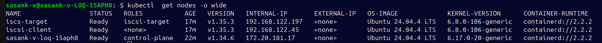
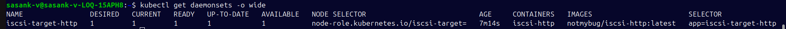
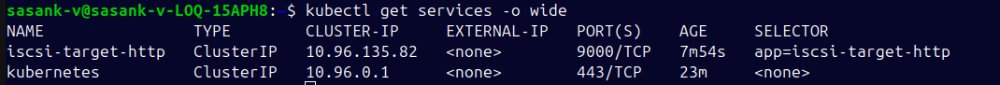
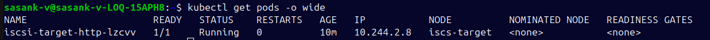
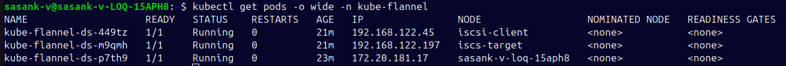
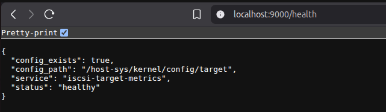
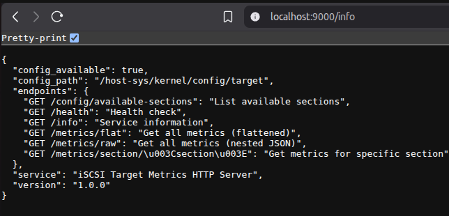
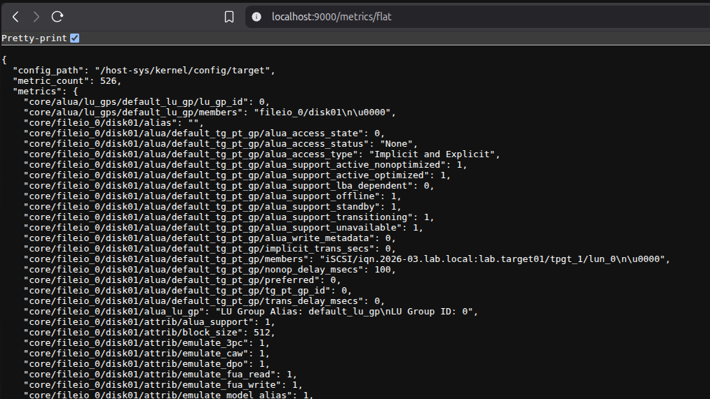
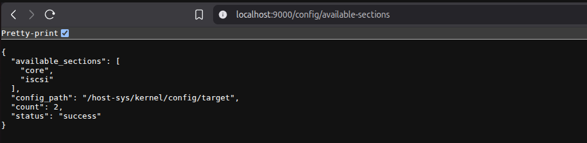
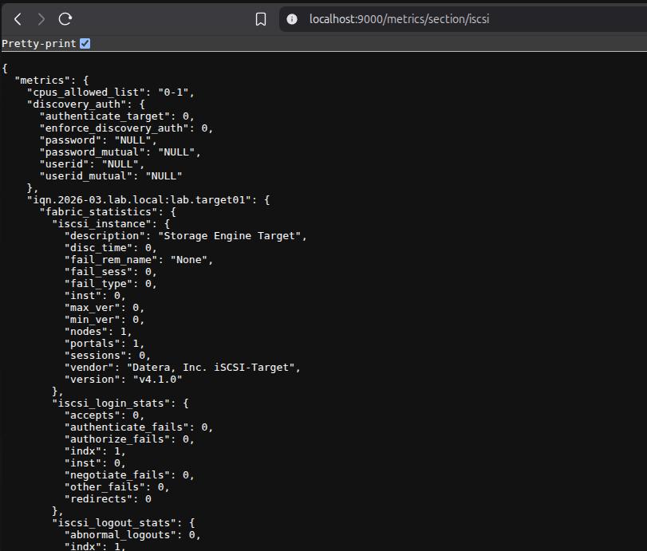

# iSCSI Metrics Retrieval

## Setup

- Control Plane:
  Master Node ( Host OS - Ubuntu Desktop )
- Data Plane:
  - Worker Nodes ( Ubuntu Server VMs ):
    iscsi-target
    iscsi-client

## Create a Kubernetes Cluster

1. Install containerd, kubeadm, kubectl and kubelet
2. Intialize a kubernetes cluster

```
sudo kubeadm init   --apiserver-advertise-address=192.168.122.1   --pod-network-cidr=10.244.0.0/16
mkdir -p $HOME/.kube
sudo cp -i /etc/kubernetes/admin.conf $HOME/.kube/config
sudo chown $(id -u):$(id -g) $HOME/.kube/config
```

3. Configure Flannel CNI Plugin

```
kubectl apply -f https://github.com/flannel-io/flannel/releases/latest/download/kube-flannel.yml
```

4. Connect worker nodes to the cluster (Run in worker nodes)

```
sudo kubeadm join 192.168.122.1:6443 --token aug72c.zv0e2uuxj78swyy4 \
	--discovery-token-ca-cert-hash sha256:d1778ccf7bca45bfc5a30a9a214fbebcde4e62a09e682063d1d13c080de5e797
```

5. Add iscsi-target role to the iscsi-target node

```
kubectl label node iscs-target node-role.kubernetes.io/iscsi-target="" --overwrite
```

## Build & Push Docker Image

1. Build the docker image from the DockerFile in the setup folder

```
docker build -t iscsi-http:latest -f docker/Dockerfile.iscsi.http .
```

2. Tag the docker image ( Replace notmybug with your dockerhub username )

```
docker tag iscsi-http:latest notmybug/iscsi-http:latest
```

3. Login to dockerhub

```
docker login
```

4. Push the docker image (Replace notmybug with your dockerhub username)

```
docker push notmybug/iscsi-http:latest
```

View my docker image here: https://hub.docker.com/r/notmybug/iscsi-http

## Run Daemonset and Service

1. Apply the `iscsi-http.yaml` to the kubernetes cluster

```
kubectl -n default apply -f setup/iscsi-http.yaml
```

2. Verify the status of daemonset and service deployed

```
kubectl -n default rollout status daemonset/iscsi-target-http
kubectl -n default get pods -l app=iscsi-target-http -o wide
kubectl -n default get ds iscsi-target-http -o yaml
```

## Test the HTTP endpoint

1. Port forward the service

```
kubectl -n default port-forward service/iscsi-target-http 9000:9000
```

2. Test the endpoint using curl or open the url in the browser

```
curl http://localhost:9000/metrics/flat
curl http://localhost:9000/info
curl http://localhost:9000/metrics/flat
```

## Results:

- Kubernetes Cluster

  
  
  
  
  

- HTTP Responses

  
  
  
  
  

## References:

- https://github.com/Devansh-Soni-1909/group-learning-hub/blob/main/Week%204/Week%204%20-%20Work.md
- https://kubernetes.io/docs/reference/setup-tools/kubeadm/kubeadm-join/
- https://kubernetes.io/docs/concepts/overview/working-with-objects/namespaces/
- https://kubernetes.io/docs/concepts/storage/volumes/
- https://kubernetes.io/docs/concepts/services-networking/service/
